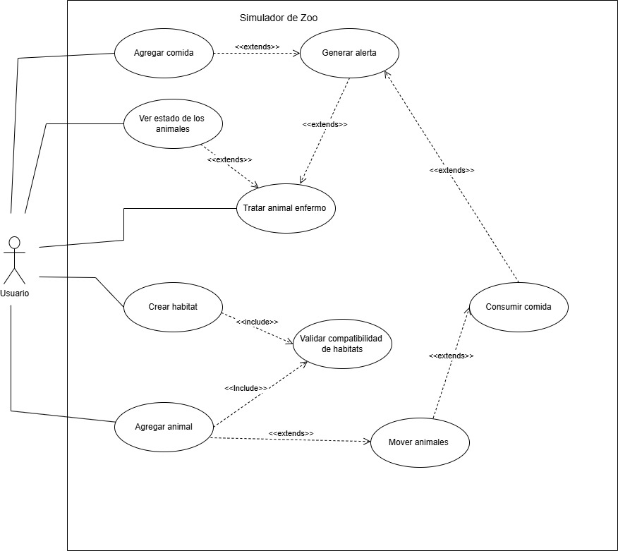

# ProyectoSemestral
Nombres: Ignacio Sebastian Jara Valdebenito, Danitza Andrea Avila Fica, grupo numero 4
Proyecto Semestral de Programación II,
Tema: Simulador de Zoo

En el presente proyecto, se creó un simulador de un zoologico, utilizando todo lo aprendido en el curso de
programación II. 
Enunciado del problema: El simulador de zoo permite al usuario crear y gestionar su propio zoológico virtual de manera 
interactiva. El usuario puede construir diferentes habitats para una variedad de animales, pueden seleccionar
entre diferentes especies de animales y colocarlas de manera estratégica en los habitats adecuados para ellos. Cada 
animal tiene necesidades específicas, como alimentación, temperatura y posibles compañeros de grupo. Se puede colocar 
habitats de forma manual (visto desde un menú), también se puede colocar comida en ellos.
Los animales, que pueden ser representados mediante polígonos o imágenes se mueven aleatoriamente dentro de los 
habitats (mediante un temporizador) y a veces consumen comida. Este software debiese garantizar que los animales sean
ubicados en los habitats adecuados para ellos y cuando falte comida en alguno de los habitats se genere una alerta.

Diagrama UML: 

Diagrama de casos de uso:

Patrones utilizados: 
Singleton: explicar por que usamos singleton

Clase que forma parte del patrón Singleton: 1.- Zoo

Factory: explicar por que usamos este patron

Clases que forman parte de Factory:1.- Animal, 2.- Comida, 3.- Habitat

Observer: explicar por que se uso observer

Clase que forma parte de observer: 1.- ZooController

captura de pantalla de la interfaz:

Decisiones a tomar dentro del proyecto: Cada habitat tendra una imagen referente en ves de una figura de un solo color,
Nuest

Problemas encontrados: Nuestro mayor problema ha sido implementar la interfaz gráfica a nuestro proyecto,
ya que era necesario descargar otros componentes a Intellij, además de implementar la lógica de dicha interfaz 
para que coincidiera con nuestro proyecto
