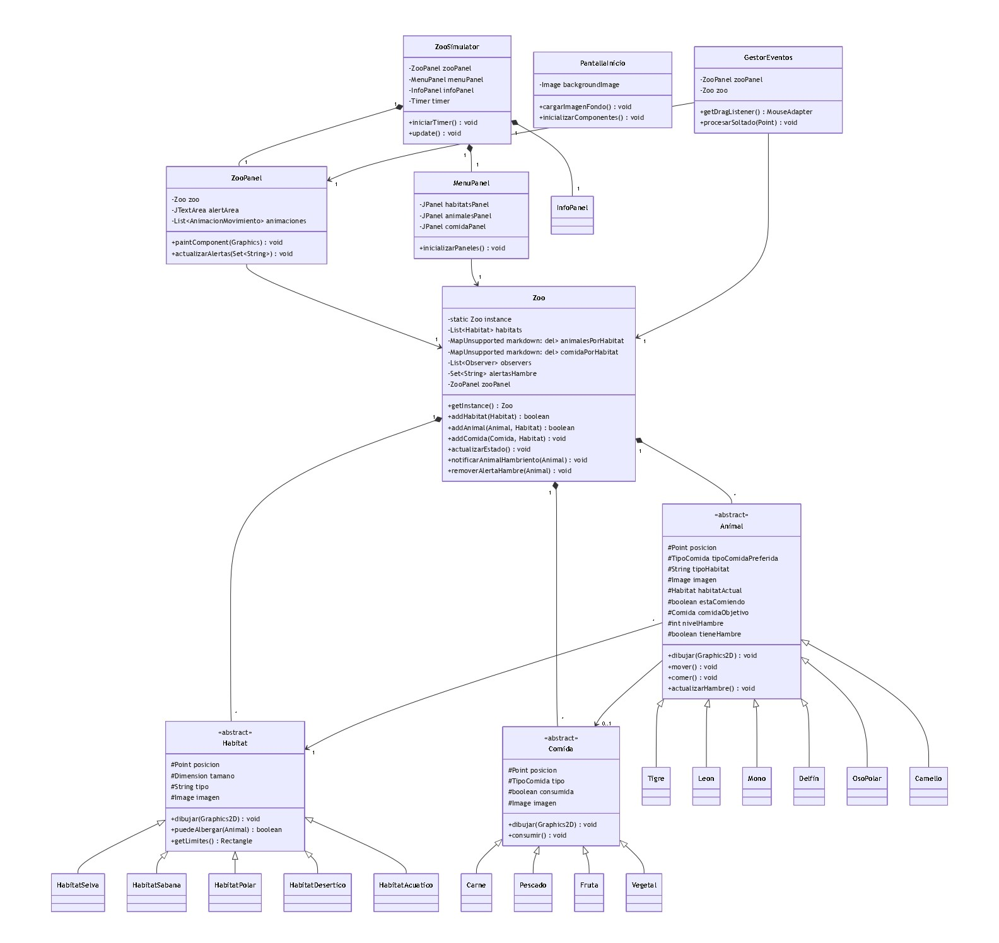

# Simulador de zoológico

Nombres: Ignacio Sebastian Jara Valdebenito, Danitza Andrea Avila Fica, grupo número 4
Proyecto Semestral de Programación II,
Tema: Simulador de Zoo

En el presente proyecto, se creó un simulador de un zoológico, utilizando todo lo aprendido en el curso de
programación II.
Enunciado del problema: El simulador de zoo permite al usuario crear y gestionar su propio zoológico virtual de manera
interactiva. El usuario puede construir diferentes habitats para una variedad de animales, pueden seleccionar
entre diferentes especies de animales y colocarlas de manera estratégica en los habitats adecuados para ellos. Cada
animal tiene necesidades específicas, como alimentación, temperatura y posibles compañeros de grupo. Se puede colocar
habitats de forma manual (visto desde un menú), también se puede colocar comida en ellos.
Los animales, que pueden ser representados mediante polígonos o imágenes se mueven aleatoriamente dentro de los
habitats (mediante un temporizador) y a veces consumen comida. Este software debiese garantizar que los animales sean
ubicados en los habitats adecuados para ellos y cuando falte comida en alguno de los habitats se genere una alerta.

Diagrama UML:

Diagrama de casos de uso:

Patrones utilizados:
Singleton: Se asegura de que una clase tenga una única instancia y proporciona un punto global de acceso a ella.
El patrón Singleton nos es útil para gestionar recursos compartidos como inventarios de comida o la lista de hábitats.

Clase que forma parte del patrón Singleton: 1.- Zoo: esta clase administra el estado general del zoológico

Factory: Porque permite delegar la creación de objetos a subclases específicas, lo que facilita la extensión del
sistema y reduce el acoplamiento entre las clases. Es util para agregar nuevos animales, habitats o alimentos. 
Crea instancias de animales, habitats y comida según el tipo solicitado

Clases que forman parte de Factory:1.- AnimalFactory, 2.- ComidaFactory, 3.- HabitatFactory

Observer: Porque nos sirve para manejar las alertas o notificaciones sobre el estado de los animales, por ejemplo si falta comida
permite que múltiples objetos sean notificados automáticamente cuando el estado de un objeto observado cambia.

Clases que forma parte de observer: 1.-Zoo, 2.- ZooSimulator, 3.- InfoPanel, 4.- ZooPanel 

Template Method: Define el esqueleto de operaciones dejando detalles a las subclases
Clases que forman parte de Template Method: 1.- Animal, 2.- Habitat, 3.- Comida

Strategy: Se implementó en el comportamiento de movimiento de los animales, permite
diferentes estrategias de movimiento según el estado del animal
Clase que forma parte de Strategy: implicitamente en Animal, en el estado de los animales

Composite: Implementado en la estructura de la interfaz gráfica, en la jerarquía de componentes de la UI.
Permite tratar grupos de objetos y objetos individuales de manera uniforme

Clase en que está implementado: ZooPanel

State: Implementado en el comportamiento de los animales según su estado (hambriento, comiendo, etc.)
Clase que forma parte de State: implicitamente en clase Animal, en el estado de los animales 

Captura de pantalla de la interfaz:  

Decisiones a tomar dentro del proyecto: Cada habitat tendrá una imagen referente en vez de una figura de un solo color.
Inicialmente, el simulador consistía en ingresar a través de un menú principal a cada acción que debía realizar el usuario, sin
embargo, esto involucraba el paso por muchas pantallas, lo que hacía tedioso su uso y poco interactivo, que no era lo que
nuestro referente necesitaba que dicho simulador cumpliera, por lo que se debió cambiar el formato de presentación y reducirlo a
una sola pantalla, en donde se visualizaran las acciones ejecutadas por el usuario, asi como los habitats y los animales.

Se tomó la decisión radical de hacer el proyecto desde cero, pues las mejoras implementadas en el código anterior no
estaban dando resultados favorables, además el referente detectó uso de ia, lo que implicó una penalización en el proyecto general

Problemas encontrados: Nuestro principal y mayor problema ha sido implementar la interfaz gráfica a nuestro proyecto,
ya que era necesario descargar otros componentes a Intellij, además de implementar la lógica de dicha interfaz
para que coincidiera con nuestro proyecto.
Se nos ha dificultado en mayor medida hacer que el simulador de zoo sea interactivo para el usuario.
